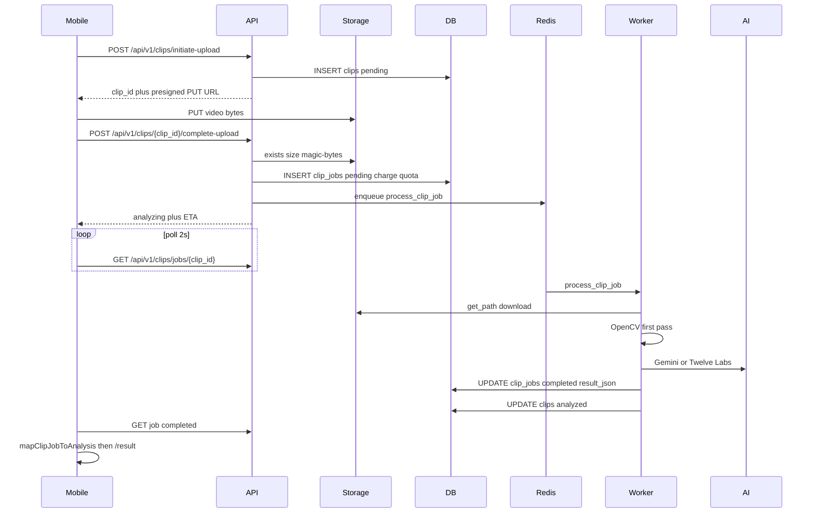

# OF-001 � Existing clip analysis path (as-is)

**Status:** Closed  
**Date:** 2026-08-21  
**Phase:** 0 contract verification  

Read-only inventory. No production changes. File paths below refer to the Onflow Demo reference client and `services/api` backend unless noted.

No implementation. This ticket only records what the code does today.

Two capture paths exist. This map is the **signed-in, active-session server path**. Unsigned or session-less capture never hits the API: [`app/capture.tsx`](app/capture.tsx) `runUserClipLocal` ? [`src/engine.ts`](src/engine.ts) `analyzeUserClip`. Session LAND/MISS taps ([`src/api/attemptApi.ts`](src/api/attemptApi.ts)) are a parallel flow, not this pipeline.

**ID coupling:** V1 uses the same UUID for `clips.id` and `clip_jobs.id`. Mobile polls `/api/v1/clips/jobs/{clip_id}`.

---

## 1. Mobile capture and upload orchestration

- **File:** [`app/capture.tsx`](app/capture.tsx)
- **Function:** `uploadUserClip`
- **Input:** `ImagePicker.ImagePickerAsset` (uri, duration ms, width, height, mime), active `sessionId`, signed-in `user_id`, optional `selectedTrick.trickId`
- **Output:** `clip_id` string; persists job via `savePendingAnalysisJob`; sets `pendingClipJobId`; navigates to `/analyzing`

- **File:** [`src/api/clipApi.ts`](src/api/clipApi.ts)
- **Function:** `uploadClipToSession`
- **Input:** `UploadClipParams` (`sessionId`, `fileUri`, `mimeType`, `durationSeconds`, `widthPx`, `heightPx`, `sizeBytes`, optional `clientHintTrickId`)
- **Output:** `ApiResult<string>` = `clip_id`
- **Internal sequence:** `initiateSessionClipUpload` ? `uploadClipToPresignedUrl` ? `completeSessionClipUpload`

`initiateSessionClipUpload` does **not** send `captured_at` (schema documents that onflow-lite omits it).

---

## 2. API initiate-upload

- **File:** [`services/api/app/routers/clips_v1.py`](services/api/app/routers/clips_v1.py)
- **Function:** `initiate_clip_upload`
- **Route:** `POST /api/v1/clips/initiate-upload` (HTTP 201)
- **Input schema:** [`ClipInitiateUploadRequest`](services/api/app/schemas/clips.py) — `session_id`, `duration_seconds` (?30), `width_px`, `height_px`, `content_type` (`video/mp4` | `video/quicktime`), `size_bytes` (?100MB), optional `client_hint_trick_id`, optional `captured_at`
- **Gates (non-consuming):** `_require_upload_feature`, `check_analysis_quota`, `check_daily_spend_cap`, `_resolve_session_for_upload` + `assert_session_accepts_clip`
- **Helpers:** [`clip_upload.py`](services/api/app/services/clip_upload.py) `new_clip_id`, `clip_storage_key` ? `clips/{user_id}/{clip_id}.{mp4|mov}`, `presigned_put_url`
- **DB write:** [`ClipModel`](services/api/app/models.py) row, `upload_status="pending"`
- **Output:** `ClipInitiateUploadResponse` — `clip_id`, `upload_url`, `upload_method="PUT"`, `upload_expires_at`, `storage_key`

Product quota is **not** charged here.

---

## 3. Storage PUT (bypasses API)

- **File:** [`src/api/clipApi.ts`](src/api/clipApi.ts) `uploadClipToPresignedUrl`
- **Input:** presigned `upload_url`, local `fileUri`, `mimeType`
- **Native:** `FileSystem.uploadAsync` PUT `BINARY_CONTENT` with `Content-Type`
- **Web:** `fetch` blob PUT
- **Dev stub:** URLs starting `local://` return success without writing bytes
- **Output:** `ApiResult<void>`

- **Server URL mint:** [`clip_upload.py`](services/api/app/services/clip_upload.py) `presigned_put_url`
  - [`S3Storage`](services/api/app/services/object_storage.py): boto3 `generate_presigned_url("put_object")`, 1h expiry (Cloudflare R2 when `ONFLOW_S3_*` is set)
  - [`LocalStorage`](services/api/app/services/object_storage.py): returns `local://upload/{key}` placeholder

---

## 4. API complete-upload ? job + queue

- **Router:** [`clips_v1.py`](services/api/app/routers/clips_v1.py) `complete_clip_upload` ? `POST /api/v1/clips/{clip_id}/complete-upload`
- **Implementation:** [`clip_v1_pipeline.py`](services/api/app/services/clip_v1_pipeline.py) `complete_v1_clip_upload`
- **Input:** `clip_id`, auth `user_id`
- **Verify:** `_verify_upload_object` — `storage.exists`, `storage.size` vs `clip_max_upload_bytes`, `looks_like_video` ([`video_signature.py`](services/api/app/services/video_signature.py)); invalid objects are deleted
- **Quota:** [`clip_quota.py`](services/api/app/services/clip_quota.py) `create_job_charging_quota` (charged here: unlimited / monthly free / bonus, else 429)
- **Job:** [`ClipJobRecord.new_pending`](services/api/app/domain/clip_job.py) with `id=clip_id`, `input_reference=storage:{key}`, metadata `{tricks, v1_skate_session_id, v1_clip_id}`
- **Clip row:** `upload_status="analyzing"`
- **Enqueue:** [`job_queue.py`](services/api/app/services/job_queue.py) `enqueue_clip_job(clip_id, storage_key, user_id)`
- **Output:** `ClipCompleteUploadResponse` plus `estimated_analysis_completion_at` ? now + 45s
- **Idempotency:** already `analyzing` / in-flight job returns 200 with ETA; already `analyzed` or completed job returns 409 (mobile treats 409 as success)

---

## 5. Queue / worker process

- **File:** [`services/api/app/services/job_queue.py`](services/api/app/services/job_queue.py)
- **Enqueue:** Redis ARQ `process_clip_job` with `_job_id=f"clip:{job_id}"` when `ONFLOW_REDIS_URL` is set; otherwise in-process `asyncio.create_task` (blocked in production)
- **Worker entry:** `process_clip_job(ctx, job_id, storage_key, user_id)`
  - Input: job id + storage key + user id
  - Skips if job already `completed`/`failed`
  - `storage.get_path(storage_key)` ? local file (S3 downloads to temp)
  - Calls `run_clip_job`
  - Output: `"done:{job_id}"` or `"skipped:{status}"`
- **Worker settings:** `WorkerSettings` — `arq app.services.job_queue.WorkerSettings`; `max_jobs` / `job_timeout` from settings; also cron `reap_pending_clips_cron`
- **Not used:** Celery. No websocket/push for analysis.

Startup recovery: [`main.py`](services/api/app/main.py) `_resume_interrupted_jobs` re-enqueues pending/processing jobs.

---

## 6. Worker: claim, first pass, provider call

- **File:** [`clip_worker.py`](services/api/app/services/clip_worker.py)
- **Function:** `run_clip_job(job_id, file_path, repo, *, user_id, storage_key)`
- **Claim:** [`clip_jobs.py`](services/api/app/repositories/clip_jobs.py) `try_claim_for_processing` — `pending` ? `processing` + `claim_token` + lease heartbeat
- **Pre-AI:** magic-byte check; [`video_first_pass.py`](services/api/app/services/video_first_pass.py) `analyze_video_first_pass(file_path)` ? `{video_readable, review_readiness, duration_seconds, motion/brightness/sharpness, ...}`. Unreadable ? `failed` / `video_unreadable` + quota refund + `sync_v1_clip_from_job_result(..., failed=True)`
- **Prompt metadata:** `ClipAnalysisMetadata.from_job_upload` + [`build_tier_aware_prompt`](services/api/app/services/gemini_tier_prompt.py)
- **Provider routing:** [`tiers.py`](services/api/app/core/tiers.py) `resolve_analysis_provider_for_tier`
  - free / trial / session_reup ? **Gemini** (`resolve_gemini_model_for_tier`)
  - pro ? **Twelve Labs Pegasus** (`settings.twelvelabs_model`, default `pegasus1.5`) unless `force_gemini_for_pro`
- **No OpenAI / Anthropic / Replicate** on this path

### Gemini (default)

- **File:** [`gemini_clip_analyzer.py`](services/api/app/services/gemini_clip_analyzer.py)
- **Function:** `analyze_clip_with_gemini(video_path, metadata, *, job_id, prompt_pack_override, settings, account_tier)`
- **SDK:** `google.genai` `client.aio.models.generate_content`
- **Input:** video (inline bytes if ? `gemini_inline_max_bytes`, else Files API upload) + `GeminiPromptPack` (system + user) + JSON `response_schema`
- **Output:** `GeminiClipAnalysis` ([`schemas/gemini_analysis.py`](services/api/app/schemas/gemini_analysis.py)) — `review_summary`, `strengths`, `improvement_areas`, `actionable_cues`, `observations`, `quality_signals`, `land_score`, optional `expected_mechanics`

### Twelve Labs (pro)

- **File:** [`twelvelabs_clip_analyzer.py`](services/api/app/services/twelvelabs_clip_analyzer.py)
- **Function:** `analyze_clip_with_twelvelabs(...)`
- **Input:** local video path + same metadata/prompt family
- **Flow:** upload asset ? poll ready ? `analyze_stream`
- **Output:** same `GeminiClipAnalysis` schema + `asset_id` for enrichment

Optional second pass (non-fatal on failure): [`GeminiReviewer.enrich`](services/api/app/services/gemini_reviewer.py) or `TwelveLabsReviewer.enrich`.

Provider failure ? `build_degraded_provider_failure_result` (job still `completed` with `review_readiness=insufficient`, quota refunded). Redis Gemini cache exists but V1 metadata does not set `content_sha256`, so cache is dormant for this upload path.

---

## 7. Response parsing and result assembly

Parse (Gemini and Twelve Labs share this):

1. [`parse_gemini_clip_analysis_dict`](services/api/app/services/gemini_analysis_parse.py) — strip fences, `json.loads`, balanced `{...}` fallback
2. [`validate_gemini_clip_analysis`](services/api/app/services/gemini_analysis_parse.py) — Pydantic `GeminiClipAnalysis`
3. [`apply_expected_mechanics_gate`](services/api/app/services/expected_mechanics_gate.py)
4. [`validate_usefulness`](services/api/app/services/gemini_output_quality.py)

Then:

- **File:** [`clip_review_assembly.py`](services/api/app/services/clip_review_assembly.py)
- **Function:** `build_completed_result_from_gemini(gemini, first_pass, clip_label, ...)`
- **Output:** `dict` matching [`ClipResultPayload`](services/api/app/schemas/clips.py) — `review_summary`, `review_readiness`, `observations`, `normalized_review`, `skate_clip_review`, `landed`, `land_score`, `best_cue`, `first_actionable_cue_shown`, quality signals, etc.

[`finalize_completed_clip_job`](services/api/app/services/clip_worker.py) then: playback hints, trick-stat compare, `_record_trick_stat`, session recap, persist job `completed` + `result_json`, keep or refund quota (`usable`/`limited` keep charge), `sync_v1_clip_from_job_result`, optional retention, delete temp/S3 unless playback TTL keeps the object.

---

## 8. Database writes

[`models.py`](services/api/app/models.py)

**`clips` (`ClipModel`)** — same id as the job

- initiate: `pending`, storage_key, dimensions, optional `session_id` / `trick_id`
- complete: `analyzing`, corrected `size_bytes`
- worker: `analyzed` or `failed`; `landed`, `pte_rating`, `thumbnail_url`, maybe `trick_id`

Sync: `sync_v1_clip_from_job_result` in [`clip_v1_pipeline.py`](services/api/app/services/clip_v1_pipeline.py)

**`clip_jobs` (`ClipJobModel`)**

- complete-upload: `pending`, `input_reference`, `clip_metadata`, `tier`, `quota_source`
- claim: `processing`, `claim_token`, `lease_expires_at`
- done: `completed` + `result_json_text`, or `failed` + `failure_reason`

**`trick_stats` (`TrickStatModel`)** — `_record_trick_stat` when the job has a named trick: landed, readiness, cue/drill, `land_score`, `session_id`

---

## 9. Mobile poll and result screen

- **Screen:** [`app/analyzing.tsx`](app/analyzing.tsx) — reads `pendingClipJobId`, calls poll, on completed maps and `setAnalysis`, navigates to `/result`
- **Poll:** [`src/analysis/pollClipJob.ts`](src/analysis/pollClipJob.ts) `pollClipJobUntilDone` — 2s interval, 10s max backoff, 180s timeout; terminal = `completed` | `failed`
- **Fetch:** [`src/api/jobApi.ts`](src/api/jobApi.ts) `fetchClipJob` ? `GET /api/v1/clips/jobs/{jobId}`
- **API:** [`routers/clips.py`](services/api/app/routers/clips.py) `get_clip_job` — pending/processing/failed envelopes, or `JobCompletedResponse` with `ClipResultPayload`
- **Parse:** [`src/api/types/clipJob.ts`](src/api/types/clipJob.ts) `parseClipJob`
- **Map:** [`src/analysis/mapClipJobToAnalysis.ts`](src/analysis/mapClipJobToAnalysis.ts) `mapClipJobToAnalysis` ? UI `Analysis` (`rating` from `normalized_review.score`, `verdict` from review summary, `workOn` from `best_cue`, evidence class from readiness)
- **Crash resume:** [`pendingAnalysisStore.ts`](src/analysis/pendingAnalysisStore.ts) AsyncStorage `{jobId, sessionId, trickName, ...}`

No SSE/websocket/push for clip analysis. Feed SSE is unrelated.

---

## Out of this path (adjacent, not the clip analysis pipeline)

- Local-only engine: [`src/engine.ts`](src/engine.ts)
- Session CRUD: [`sessions.py`](services/api/app/routers/sessions.py)
- Manual LAND/MISS: [`session_attempts.py`](services/api/app/routers/session_attempts.py)
- Abandoned-upload reaper: [`clip_pending_reaper.py`](services/api/app/services/clip_pending_reaper.py)
- Job list `GET /api/v1/clips/jobs` exists; mobile does not call it

---

## Closeout

Inventory confirmed. No production files were changed for OF-001.
